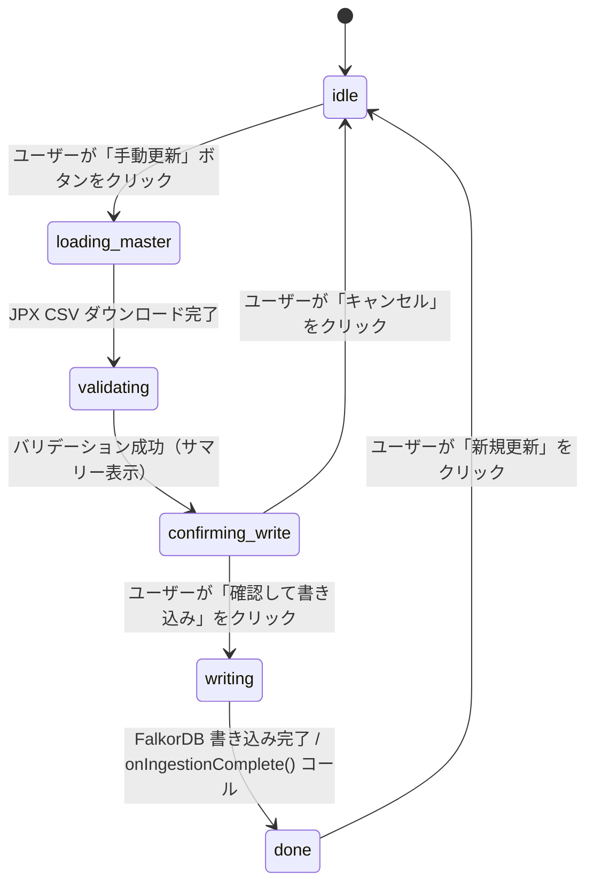
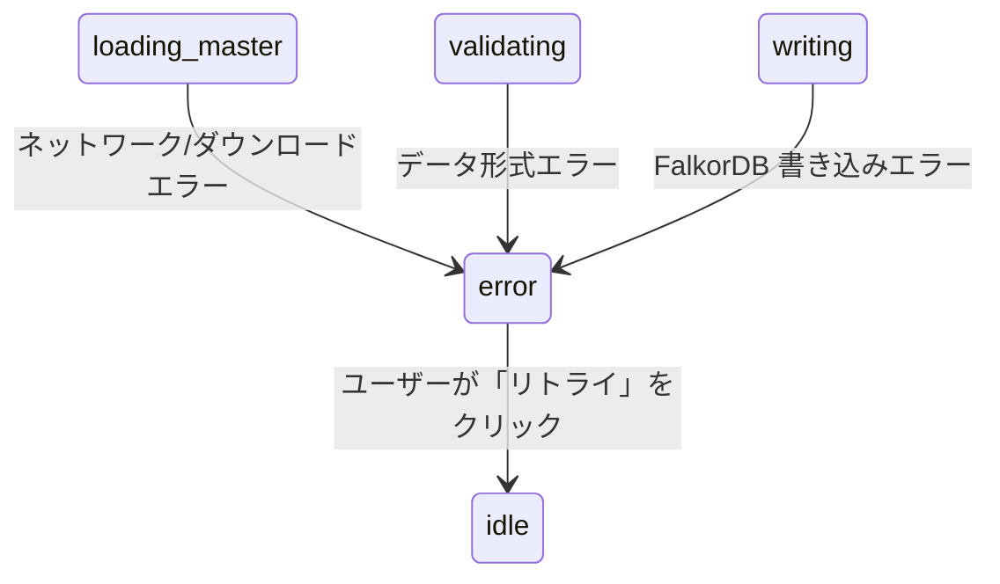

# ctx-ontology 状態遷移図

## 成功パス

```mermaid
stateDiagram-v2
    [*] --> idle

    idle --> loading_master: ユーザーが「手動更新」ボタンをクリック
    loading_master --> validating: JPX CSV ダウンロード完了
    validating --> confirming_write: バリデーション成功（サマリー表示）
    confirming_write --> idle: ユーザーが「キャンセル」をクリック
    confirming_write --> writing: ユーザーが「確認して書き込み」をクリック
    writing --> done: FalkorDB 書き込み完了 / onIngestionComplete() コール
    done --> idle: ユーザーが「新規更新」をクリック
```

## エラーパス

```mermaid
stateDiagram-v2
    loading_master --> error: ネットワーク/ダウンロードエラー
    validating --> error: データ形式エラー
    writing --> error: FalkorDB 書き込みエラー
    error --> idle: ユーザーが「リトライ」をクリック
```
